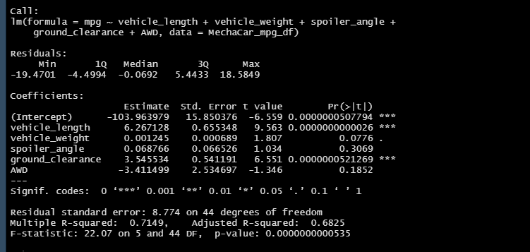

# MechaCar_Statistical_Analysis

## Overview

### Linear Regression to Predict MPG
1. Which variables/coefficients provided a non-random amount of variance to the mpg values in the dataset?
- The output of out linear model shows that the vehicle length and ground clearance have the highest impact on mpg with small p-values - A unit change in either of these variables results in 6.267 and 3.545 increase in mpg respectively.

2. Is the slope of the linear model considered to be zero? Why or why not?
- The equation from our linear model (mpg = 6.26713(vl) + 0.00125(vw) + 0.06877(sa) + 3.5455(gc) - 3.4115(AWD) - 103.9639) shows that all of the coefficients from the predictor variables are non-zero which in turn shows that the slope of the linear model is non-zero.

3. Does this linear model predict mpg of MechaCar prototypes effectively? Why or why not?
- 

