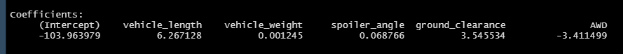

# MechaCar_Statistical_Analysis

## Overview
The purpose of this analysis was to help AutoRUS with production troubles that were blocking the manufacturing team's progress with their new prototype, the MechaCar. We reviewed production data for insights that may help the manufacturing team. To conduct our anaylsis we completed the follwing:
- Perform multiple linear regression analysis to identify which variables in the dataset predict the mpg of MechaCar prototypes 
- Collect summary statistics on the pounds per square inch (PSI) of the suspension coils from the manufacturing lots
- Run t-tests to determine if the manufacturing lots are statistically different from the mean population 
- Design a statistical study to compare vehicle performance of the MechaCar vehicles against vehicles from other manufacturers. For each statistical analysis, you’ll write a summary interpretation of the findings. 

### Linear Regression to Predict MPG
1. Which variables/coefficients provided a non-random amount of variance to the mpg values in the dataset?
- The output of out linear model shows that the vehicle length and ground clearance have the highest impact on mpg with small p-values - A unit change in either of these variables results in 6.267 and 3.545 increase in mpg respectively.

2. Is the slope of the linear model considered to be zero? Why or why not?
- The equation from our linear model (mpg = 6.26713(vl) + 0.00125(vw) + 0.06877(sa) + 3.5455(gc) - 3.4115(AWD) - 103.9639) shows that all of the coefficients from the predictor variables are non-zero which in turn shows that the slope of the linear model is non-zero.

3. Does this linear model predict mpg of MechaCar prototypes effectively? Why or why not?
- Vehicle length and ground clearance have very small p-values which helps show the relationship between mpg and these predictor variables. AWD, spoiler angle, and vehicle weight all have large p-values which shows that there isn't a statistically significant relationship between these predictor variables and mpg.
- AWD is recorded in binary format so we would consider not acknowledging the relationship between AWD and mpg in this linear model.

### Summary Statistics on Suspension Coils
1. The design specifications for the MechaCar suspension coils dictate that the variance of the suspension coils must not exceed 100 pounds per square inch. Does the current manufacturing data meet this design specification for all manufacturing lots in total and each lot individually? Why or why not?
- The total lot summary variance shows a variance of 62.29356 which is within design specifications. The individual lot summary variance shows that Lot 1 and Lot 2 are well below the design specification with a variance of 0.9795918 and 7.4693878, respectively, but Lot 3 has a variance of 170.2861224 which is well above the design specification.

Total Lot Summary Variance

Individual Lot Summary Variance

### T-Tests on Suspension Coils
1. Determine if the PSI for all manufacturing lots is statistically different from the population mean of 1,500 pounds per square inch.

- Assuming our significance level was the common 0.05 percent, our p-value is above our significance level. Therefore, we do not have sufficient evidence to reject the null hypothesis, and we would state that the two means are statistically similar.

Sample Mean vs Population Mean - T-Test Summary

2. Determine if the PSI for Lot 1 is statistically different from the population mean of 1,500 pounds per square inch.

- Assuming our significance level was the common 0.05 percent, our p-value is above our significance level. Therefore, we do not have sufficient evidence to reject the null hypothesis, and we would state that the two means are statistically similar.

Lot 1 Mean vs Population Mean - T-Test Summary

3. Determine if the PSI for Lot 2 is statistically different from the population mean of 1,500 pounds per square inch.

- Assuming our significance level was the common 0.05 percent, our p-value is above our significance level. Therefore, we do not have sufficient evidence to reject the null hypothesis, and we would state that the two means are statistically similar.

Lot 2 Mean vs Population Mean - T-Test Summary

4. Determine if the PSI for Lot 3 is statistically different from the population mean of 1,500 pounds per square inch.

- Assuming our significance level was the common 0.05 percent, our p-value is below our significance level. Therefore, we do have sufficient evidence to reject the null hypothesis, and we would state that the two means are not statistically similar.

Lot 3 Mean vs Population Mean - T-Test Summary

## Study Design: MechaCar vs Competition
If we were looking to compare MechaCar against a competitor, we would look at metrics such as cost, city or highway fuel efficiency, horse power, maintenance cost, or safety rating. To form a hypothesis, we would decide on which metric we'd like to compare to the competition such as fuel efficiency. Our null hypothesis would be there is no difference between average fuel efficiency between MechaCar and the competition's vehicles. The Alternative hypothesis would be that there is a difference between average fuel efficiency between MechaCar and the competition's vehicles. A statistical test we could perform would be a two-sample t-test due to having two samples of continuous data. The data we would use would be a data set of fuel efficiency for MechaCar and the competition.